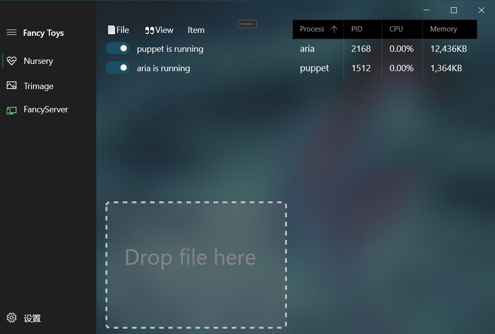
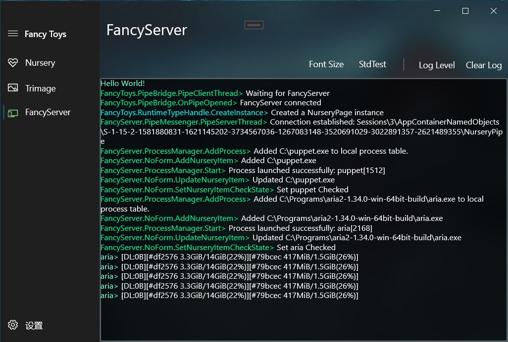
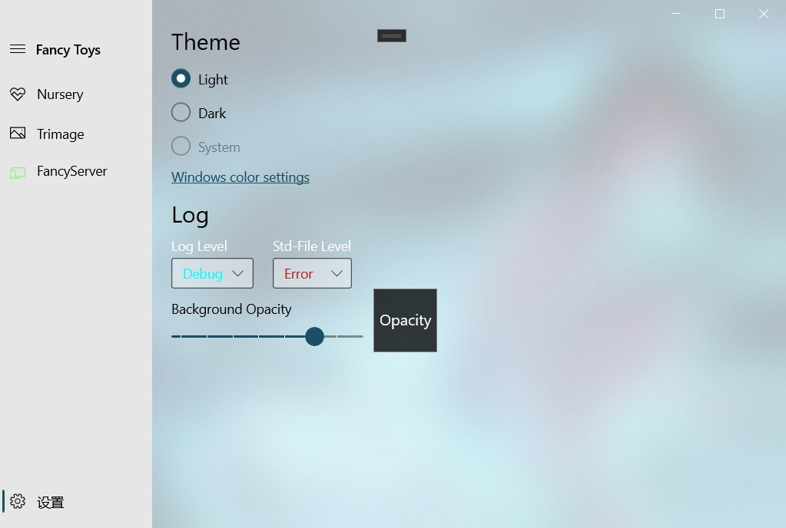

# FancyToys

  FancyToys is a toolset contains several novelties.
  All of restricted functions in UWP are moved to FancyServer, a WinForm app.

# FancyServer

FancyServer receives  FancyToys' commands via a NamedPipe. Restricted jobs are processed here.
Log and std-output/error will be sent to `ServerPage`.

## ⚙Nursery

Nursery is a weak daemon process manager that can start/stop process in background. 

## 🖼Buper(coming soon)

A batch image cropping application, its predecessor was made by electron-vue.

# 🛠Controls

+ [`NavigationView`](https://docs.microsoft.com/en-us/uwp/api/windows.ui.xaml.controls.navigationview?view=winrt-19041)
+ [`CommandBarFlyout`](https://docs.microsoft.com/en-us/uwp/api/windows.ui.xaml.controls.commandbarflyout?view=winrt-19041)
+ `ListBox`
+ `ToggleSwitch`
+ `Rectangle`
+ [`DataGrid`](https://docs.microsoft.com/en-us/windows/communitytoolkit/controls/datagrid)
+ `ContentDialog`

# 📃TODO

+ I can't hide foreground page(UWP) for now.
+ Save added data & load data before MainPage initialization.
+ Please note that you should stop all processes before closing the app. I've noted the bug [here](https://moeext.github.io/2020/09/30/fancy-toys-notes/#%E7%88%B6%E8%BF%9B%E7%A8%8B%E9%80%80%E5%87%BA%E5%90%8E%EF%BC%88%E5%AD%90%E8%BF%9B%E7%A8%8B%E4%B8%8D%E9%80%80%E5%87%BA%EF%BC%89%E7%AB%AF%E5%8F%A3%E4%B8%8D%E9%87%8A%E6%94%BE).
+ I really wanna expand the content into the title bar area. I tried but lost. As you can see, I've used arcylic in the title bar area.

