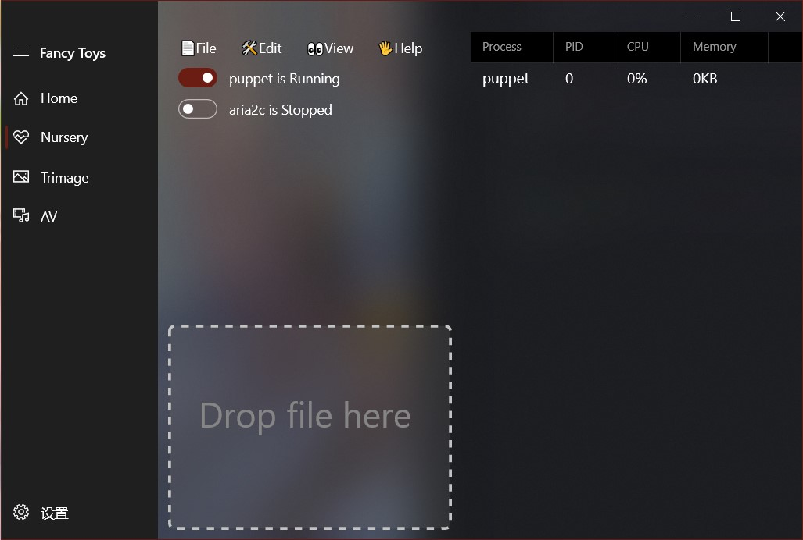

# FancyToys
  FancyToys is a list of useful tools just like PowerToys, I wish so.

## Nursery
Nursery is a weak daemon process manager that can start/stop process in background. 

### How does it work?

I had accomplished a WPF version of Nursery several days ago. I designed the xaml page and subscribed to events on Control, nothing bothered me a lot. But I didn't realize that many capabilities are restricted in UWP. It is not possible to start a `Process`, abort a thread and so on. To start a process, I put a launcher in App local storage folder. It's a socket server named [`NurseryLauncher`](Assets\Tools\NurseryLauncher.exe). By listening on port 626(Stitch), it starts a process for UWP-Nursery after receiving the instruction. UWP-Nursery will receive processes' information which is sent by the server per second later on.

### Controls

+ [`NavigationView`](https://docs.microsoft.com/en-us/uwp/api/windows.ui.xaml.controls.navigationview?view=winrt-19041) (with a `Frame`)
+ [`CommandBarFlyout`](https://docs.microsoft.com/en-us/uwp/api/windows.ui.xaml.controls.commandbarflyout?view=winrt-19041)
+ [`MenuBar`](https://docs.microsoft.com/en-us/uwp/api/windows.ui.xaml.controls.menubar?view=winrt-19041)
+ `ListBox`
+ `ToggleSwitch`
+ `Rectangle`
+ [`DataGrid`](https://docs.microsoft.com/en-us/windows/communitytoolkit/controls/datagrid)
+ `ContentDialog`

### Deficiencies
+ It's incapable of updating process information in that information doesn't in UI Thread. I will fix it with the help of `Task`.
+ I really wanna expand the content into the title bar area. I tried but lost. As you can see, I've used arcylic in the title bar area.

